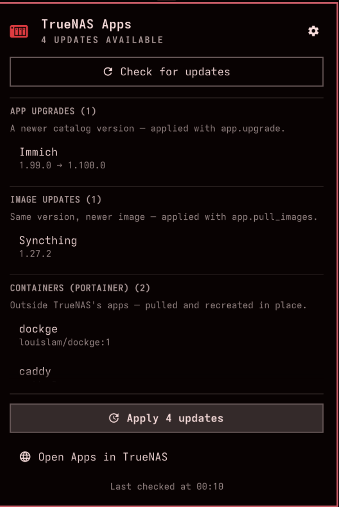
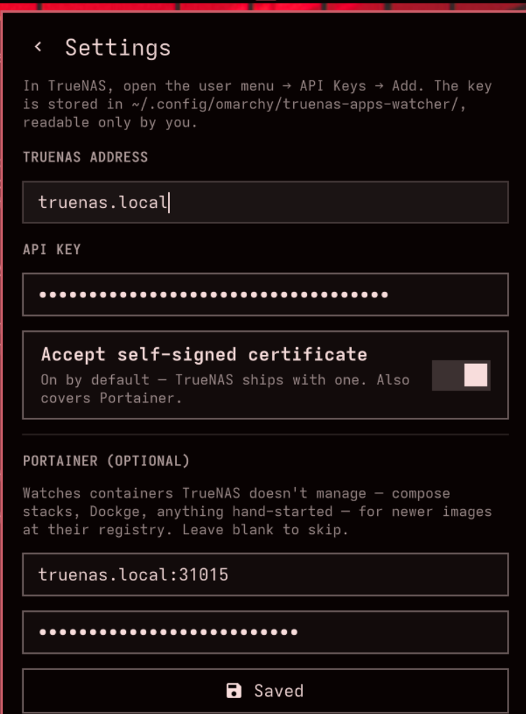

<div align="center">


<h1>TrueNAS Apps Watcher</h1>

**TrueNAS app updates in your Omarchy bar** — catalog upgrades, newer images, and the<br>
containers TrueNAS doesn't manage, watched from a bar badge and applied with one click.

[](https://plugins.omarchy.org)
[](https://github.com/davidboulay/omarchy-truenas-apps-watcher/actions/workflows/ci.yml)
[](https://quickshell.org)
[](LICENSE)

[**Install**](#install) · [Features](#features) · [Configure](#configure) · [Shortcuts](#interactions) · [Scripting](#scripting) · [How it works](#how-it-works)

</div>

<br>

A drive bay lives in your bar. It stays a muted foreground while every app on
the NAS is current, and turns the theme's attention colour **with an update
count** the moment something has an upgrade waiting.

Click it and the popup lists everything pending, grouped and versioned
(`1.99.0 → 1.100.0`). One button applies the lot, one item at a time, with live
progress read straight from TrueNAS's own job queue — and it rides out the
reverse proxy that gives up long before a container image finishes pulling.

<table align="center">
<tr>
<td width="50%" valign="top" align="center">

<br>
<sub><b>Watching</b> — app upgrades, image-only updates, and unmanaged containers in one list; one click applies the lot.</sub>
</td>
<td width="50%" valign="top" align="center">

<br>
<sub><b>Setup</b> — an address and an API key. Portainer is optional. Both keys are stored <code>0600</code> in your own config directory, never in <code>shell.json</code>.</sub>
</td>
</tr>
</table>

An Omarchy port of
[TruenasAppsWatcher](https://github.com/davidboulay/TruenasAppsWatcher), which
does the same on a COSMIC panel and in a macOS menu bar.

## Install

```bash
omarchy plugin add https://github.com/davidboulay/omarchy-truenas-apps-watcher.git --enable
```

Pick a bar section when prompted (right by default), or move it later:

```bash
omarchy bar move io.github.davidboulay.truenas-apps-watcher --section right
```

Then click the drive bay → **⚙ Settings** and fill in your address and API key.

## Configure

Everything lives in the popup's settings view:

- **TrueNAS address** — `truenas.local`, an IP, or `https://nas.example.com`.
  A bare host is tried as `https://…` first, because that is what TrueNAS
  serves out of the box, and as `http://…` second; an explicit scheme is taken
  at its word.
- **API key** — in TrueNAS, open the user menu (top right) → **API Keys → Add**.
- **Accept self-signed certificate** — **on by default**: TrueNAS ships with
  one. The same setting covers Portainer.
- **Portainer address and access token** *(optional)* — e.g.
  `truenas.local:31015`, and a token from Portainer's **user menu → My account
  → Access tokens**. Leave both blank and the container half is simply off.

## Features

- **Bar badge with the pending count.** It counts only what *Apply* can act
  on, so it is always a call to action. Anything pending that this widget
  should not touch is still listed — see the stack guard below — just never
  counted.
- **Three kinds of update, one list.**
  - **App upgrades** — a newer catalog version (`upgrade_available`), applied
    with `app.upgrade`.
  - **Image updates** — the same catalog version pointing at a newer image
    (`image_updates_available`), which is what a custom app tracking `latest`
    looks like. Applied with `app.pull_images`, so the app's configuration is
    left alone.
  - **Containers (Portainer)** — anything running on the box that TrueNAS
    doesn't manage: compose stacks, Dockge, hand-started containers. Watched by
    comparing the running image's digest against its registry, the same check
    Watchtower makes.
- **It refuses to break a stack.** Portainer's recreate replaces one container
  with a new container id. Anything pinned to the old one — a sidecar on
  `network_mode: "service:x"`, a compose `depends_on` — breaks the moment that
  id changes, and a namespace passenger can keep reporting *healthy* with no
  network at all, so nothing alarms. Those containers are listed under **Needs
  a stack update** with the dependents named and the stack's directory, and
  *Apply* never touches them. Refusing is the whole fix, not half of it:
  recreating the dependents afterwards reuses their existing config, which
  still names the dead id, so only `docker compose up -d` repairs it — and this
  widget has no shell on the NAS.
- **Real progress, not a spinner.** TrueNAS runs upgrades as middleware *jobs*;
  the widget polls `core.get_jobs` and shows the job's own percentage. Container
  pulls stream per-layer progress from the Docker API, so the bar moves while
  the layers come down.
- **Survives a reverse proxy.** An upgrade that pulls a few gigabytes outlasts
  most proxy timeouts, and the poll comes back `504` while the job is running
  perfectly well on the NAS. Gateway-class statuses (408, 502, 503, 504, 522,
  524) are read as the connection dying, not as a failed job — polling
  continues and the job finishes normally. No proxy tuning needed.
- **One failure doesn't stop the queue.** Each item is applied on its own; a
  job that ends `FAILED` contributes its first error line to a note under the
  title, and the rest of the queue carries on.
- **Being away is not an error.** Off the home network, the popup shows a
  neutral "not reachable — retrying" line and keeps retrying quietly in the
  background, recovering by itself. Portainer being unreachable is reported
  separately, so a Portainer outage never hides the apps.
- **Fresh answers on demand.** Automatic checks every 30 minutes; a manual
  *Check for updates* first runs `catalog.sync` — the same job TrueNAS runs
  daily — so a version published minutes ago shows up now.
- **Keyboard-first popup**, like every other Omarchy panel.

## Interactions

| Where | Action |
|---|---|
| Bar | left = popup · right = check for updates · middle = open TrueNAS |
| Popup | <kbd>j</kbd>/<kbd>k</kbd> or arrows = move · <kbd>Enter</kbd> = activate · <kbd>Esc</kbd> = close |
| Popup | <kbd>r</kbd> = check · <kbd>a</kbd> = apply all · <kbd>s</kbd> = settings · <kbd>o</kbd> = open in TrueNAS |

## Bar settings

Bar behaviour lives in the widget's entry in `~/.config/omarchy/shell.json`:

```json
{
  "bar": {
    "layout": {
      "right": [
        {
          "id": "io.github.davidboulay.truenas-apps-watcher",
          "refreshIntervalMin": 30,
          "containerIntervalHours": 6,
          "hideWhenUpToDate": false
        }
      ]
    }
  }
}
```

| Key | Default | What it does |
|---|---|---|
| `refreshIntervalMin` | `30` | Minutes between background app checks (5–720). |
| `containerIntervalHours` | `6` | Hours between registry lookups for unmanaged containers (1–168). |
| `hideWhenUpToDate` | `false` | Keep the bar clear until something needs updating. |

## Where the keys live

The **connection** — addresses, both keys, and the TLS preference — is kept
apart from `shell.json`, in `~/.config/omarchy/truenas-apps-watcher/`
(directory `0700`):

- `config.json` (`0600`) — the settings the panel writes.
- `auth.conf` (`0600`) — the `Authorization: Bearer` header for TrueNAS.
- `portainer-auth.conf` (`0600`) — the `X-API-Key` header for Portainer.

Both header files are handed to curl with `-K`, so neither key ever appears in
a process argument list. They are regenerated from `config.json` whenever a key
changes.

`shell.json` is world-readable and ends up in screenshots and support threads;
a TrueNAS API key is root on the whole NAS, so it does not go there. Edit the
connection through **⚙ Settings** in the popup — hand-edits to `config.json`
are picked up on the next `omarchy restart shell`.

## Scripting

The widget answers on the `truenas` IPC target:

```bash
omarchy-shell truenas status      # "4 updates available"
omarchy-shell truenas count       # "4"
omarchy-shell truenas progress    # percent while applying, else -1
omarchy-shell truenas refresh     # catalog.sync, then re-read the apps
omarchy-shell truenas containers  # re-check unmanaged containers at their registries
omarchy-shell truenas install     # apply everything pending
omarchy-shell truenas settings    # open the popup on the connection form
omarchy-shell truenas version     # which build is installed, e.g. "1.2.0"
omarchy-shell truenas toggle      # show/hide the popup
```

## How it works

### TrueNAS apps

Everything goes through the TrueNAS SCALE REST API (`/api/v2.0`) with an API
key — no middleware plugin to install on the NAS side:

- **Watching:** `GET /api/v2.0/app` lists the installed apps and their
  `upgrade_available` / `image_updates_available` flags.
- **Applying:** `POST /api/v2.0/app/upgrade` or `app/pull_images`. Both return
  a job id rather than doing the work inline; `GET /api/v2.0/core/get_jobs?id=`
  is polled every two seconds for `state` and `progress.percent` until it
  reaches `SUCCESS`, `FAILED`, `ABORTED` or `ERROR`.
- **Refreshing:** `catalog.sync` — which the REST layer maps to **GET**,
  because the method takes no arguments (POST answers 405). It is a job too, so
  a manual check waits for it before re-reading the apps.

### Unmanaged containers, through Portainer

TrueNAS only tracks updates for its own apps. Everything else is watched
through Portainer's Docker API proxy:

- Containers are listed per environment; the `ix-*` compose projects TrueNAS
  manages are skipped, because the apps check already covers them, and so are
  images pinned by digest, which cannot drift.
- "Update available" means the tag's digest at the registry matches none of the
  running image's `RepoDigests` — Watchtower's rule. The registry is asked
  directly, with the anonymous Bearer-token dance Docker Hub, ghcr.io and lscr
  all use. Measured against Docker Hub, a manifest `HEAD` does not spend the
  anonymous pull allowance.
- Applying pulls the image first, through `POST /images/create`, whose
  newline-delimited JSON stream gives per-layer progress; the container is then
  recreated with its existing configuration and `PullImage: false`. If the
  streamed pull isn't possible, it falls back to letting the recreate pull —
  no progress bar, but it works.

## Requirements and privileges

- **Omarchy** with the Quickshell-based shell (`omarchy-shell`).
- **`curl`** on `PATH` — every API call. Part of a base Omarchy install.
- **`omarchy-launch-browser`** — only for "Open Apps in TrueNAS".
- **A Nerd Font** for the bar (Omarchy's default): the badge is `nf-md-nas`.
- **No elevated privileges.** Nothing is run with `sudo`, `pkexec` or polkit.
  Network traffic goes to the TrueNAS address you configure, the Portainer
  address if you configure one, and the registries your containers' images come
  from.
- Like every Omarchy plugin, this runs unsandboxed inside the long-lived
  `omarchy-shell` process. It starts no second Quickshell instance.

## Update and remove

```bash
omarchy plugin update io.github.davidboulay.truenas-apps-watcher
omarchy plugin remove io.github.davidboulay.truenas-apps-watcher
```

Removing the plugin leaves your connection details behind, in case you add it
back. To take those with it:

```bash
rm -rf ~/.config/omarchy/truenas-apps-watcher   # addresses and both keys
```

Nothing else is written outside `~/.config/omarchy/plugins/<plugin-id>/` and
this widget's own entry in `shell.json`, which `omarchy plugin remove` clears.

## Layout

```
manifest.json   plugin contract: id, kind bar-widget, entry point, settings schema
Panel.qml       the widget: bar badge, popup, sections, settings view, keyboard nav
Service.qml     the two APIs over curl: apps, jobs, containers, registries, the queue
Model.js        pure logic — address shapes, response and job parsing, image refs, summaries
test/           node test/model-test.js · node test/manifest-test.js · a mock server
docs/           icon and screenshots
```

## Development

```bash
git clone https://github.com/davidboulay/omarchy-truenas-apps-watcher.git
cd omarchy-truenas-apps-watcher
node test/model-test.js
node test/manifest-test.js
omarchy plugin validate .
```

`test/mock-server.py` stands in for both a TrueNAS box and a Portainer next to
it, so the whole thing — including the install queue and its job progress — can
be exercised without a NAS:

```bash
python3 test/mock-server.py    # then point the plugin at 127.0.0.1:8899
```

It takes `GATEWAY_504=1` to answer job polls with a proxy's `504` page for the
first few seconds of every job, and `FAIL_APP=<name>` to make one job fail —
the two paths hardest to reproduce against a real server.

`qmllint` resolves `qs.Commons` / `qs.Ui` only if the shell directory is
reachable as a `qs` module, so point it at a directory holding a `qs` symlink to
`$OMARCHY_PATH/shell` (keep the symlink outside the plugin folder — the shell
refuses plugins containing one):

```bash
mkdir -p /tmp/qsimports && ln -sfn "$OMARCHY_PATH/shell" /tmp/qsimports/qs
qmllint -I /tmp/qsimports *.qml
```

Saving a file under `~/.config/omarchy/plugins/` reloads the plugin
automatically; changes to the IPC surface need `omarchy restart shell`.

## License

GPL-3.0-only
